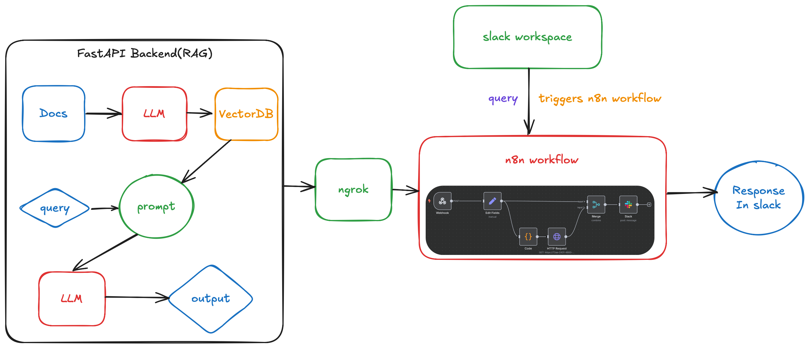
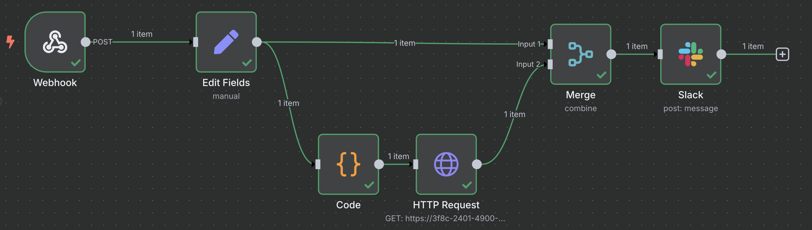
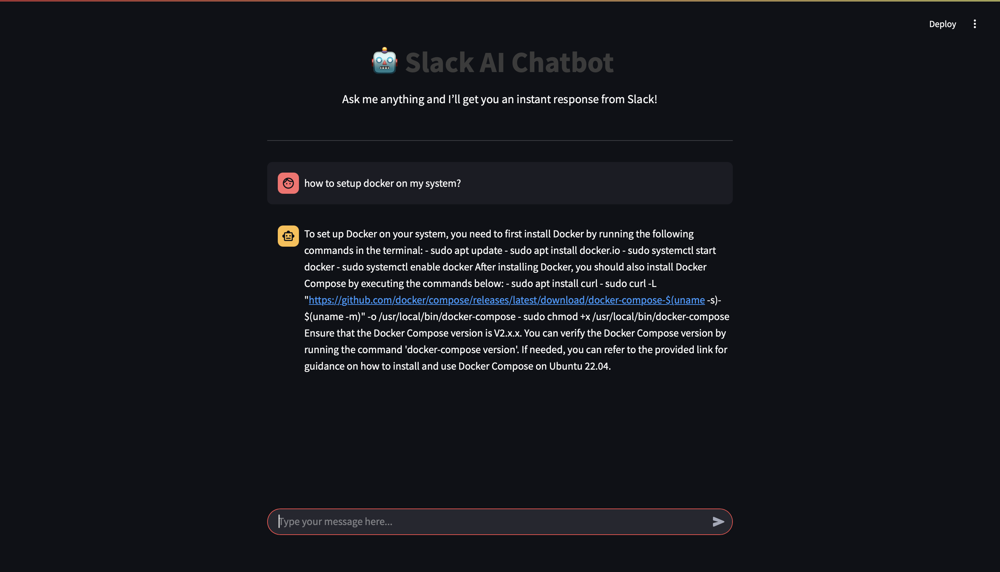
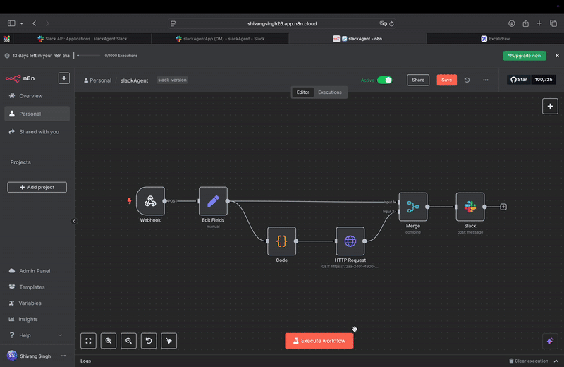
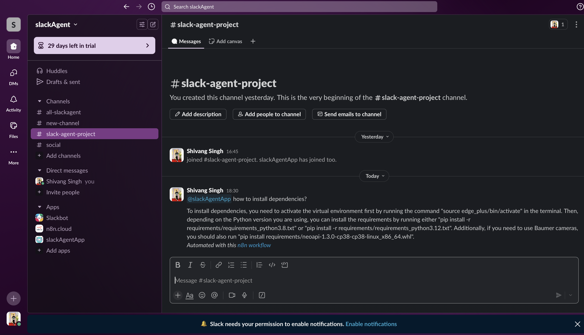
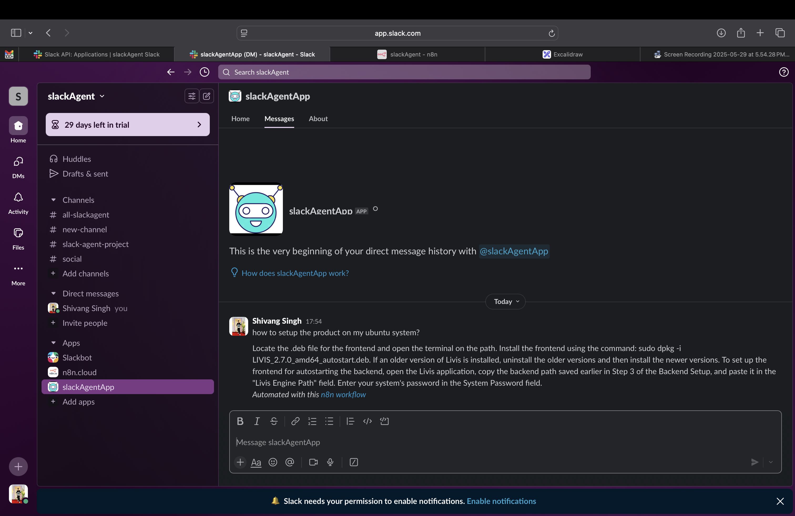

# 🚀 slackAgent

**slackAgent** is an *AI-powered Slack bot* that answers your questions using a **LlamaIndex** and **ChromaDB** vector database! 🤖 It chats via **Slack API**, automates workflows with **n8n**, and offers a sleek **Streamlit** web UI. Powered by **OpenAI embeddings** and **FastAPI**, it delivers *smart document retrieval* with ease. ✨

---

## 🎉 Features

- **Slack Chat** 💬: Answers queries in Slack channels or DMs.
- **AI Search** 🔍: Queries documents with LlamaIndex and ChromaDB.
- **Automation** ⚙️: Streamlines tasks with n8n workflows.
- **Web UI** 🌐: Query via a user-friendly Streamlit interface.
- **Local-to-Web** 🔗: Exposes APIs using **ngrok**.

---

## 📂 Project Structure

- `app.py`: Loads docs, creates OpenAI embeddings, stores in ChromaDB. 📚
- `main.py`: FastAPI backend for answering queries. 🚀
- `.env`: Holds API keys and directory paths. 🔑
- `requirements.txt`: Lists dependencies (e.g., `llama-index`, `chromadb`). 📦
- `storage/`: Stores vector embeddings. 💾
- `documentation/`: Holds documents for indexing. 📄

---

## 🛠️ Setup Instructions

### 📋 Prerequisites
- Python >= 3.9 🐍
- Slack account + workspace
- n8n account
- ngrok account
- OpenAI API key

### ⚡️ Installation

1. **Clone the Repo** 📥
   ```bash
   git clone https://github.com/shivangsingh26/slackAgent.git
   cd slackAgent
   ```

2. **Set Up Virtual Environment** 🌍
   ```bash
   python3 -m venv venvSlackAgent
   source venvSlackAgent/bin/activate
   ```

3. **Install Dependencies** 📦
   ```bash
   pip install -r requirements.txt
   ```

4. **Configure Environment** 🔧
   - Create a `.env` file:
     ```
     OPENAI_API_KEY=your-openai-api-key
     DOCUMENTATION_DIR=./documentation
     STORAGE_DIR=./storage
     ```

5. **Add Documents** 📝
   - Place files in the `documentation/` folder.

6. **Generate Embeddings** 🧠
   - Run `app.py` to index documents:
     ```bash
     python3 app.py
     ```

7. **Run FastAPI Backend** 🚀
   - Start the server:
     ```bash
     uvicorn main:app --reload
     ```

8. **Set Up ngrok** 🌐
   - **What is ngrok?** Creates a public URL for your local server. 🔗
   - **Why use it?** Lets Slack and n8n talk to your FastAPI backend. 🌍
   - **Steps**:
     1. Sign up at [ngrok.com](https://ngrok.com) for an authtoken.
     2. Authenticate ngrok:
        ```bash
        ngrok authtoken <your-ngrok-authtoken>
        ```
     3. Run ngrok (default port 8000, adjust if needed):
        ```bash
        ngrok http http://localhost:8000
        ```
     4. Copy the ngrok URL (e.g., `https://<random>.ngrok.io`).

---

### 🤝 Slack API Setup

The **Slack API** lets your bot read/post messages and automate tasks. The **Events API** sends payloads when events (e.g., messages) happen. 🎉

1. Create a Slack app at [api.slack.com](https://api.slack.com). 🛠️
2. Add these **bot token scopes**:
   - `app_mentions:read` 📣: Detects `@slackAgent` mentions.
   - `channels:history` 📜: Reads public channel message history.
   - `channels:join` 🚪: Joins public channels.
   - `channels:read` 👀: Accesses public channel details.
   - `chat:write` ✍️: Sends messages in channels/DMs.
   - `chat:write.public` 📢: Posts in public channels without joining.
   - `commands` ⚡: Supports custom slash commands.
   - `im:history` 💬: Reads DM history.
   - `im:write` 📩: Sends DMs.
   - `mpim:history` 👥: Reads group DM history.
3. Enable **Event Subscriptions** with your ngrok URL (e.g., `https://<random>.ngrok.io/slack/events`). 🔗
4. Subscribe to **bot events**:
   - `message.channels` 📢: Triggers on public channel messages.
   - `message.im` 💌: Triggers on direct messages.
5. Verify the setup:
   - In n8n, set a webhook node with a challenge field for Slack’s verification.
   - Set webhook to **"Respond to WebHook"** mode, then switch to **"Immediately"** after verification.
6. Add the bot (`slackAgentApp`) to your Slack workspace. 🤖

---

### ⚙️ n8n Workflow Setup

Automate with [n8n](https://n8n.io)! 🛠️ Visualize the workflow:




1. Create an n8n workflow with these nodes:
   - **Webhook** 🌐: Captures Slack events and verifies challenges.
   - **Set Node** 📝: Extracts `user_query` and `channel_id`.
   - **Cleanup Node** 🧹: Removes mentions (e.g., `@slackAgentApp`).
   - **HTTP Server Node** 🔗: Sends queries to FastAPI via ngrok.
   - **Merge Node** 🔄: Combines query and response into JSON.
   - **Slack Node** 💬: Sends responses to your Slack workspace.
2. Authenticate the Slack node with your workspace. 🔑
3. Run the workflow and test with a Slack query (e.g., `@slackAgentApp how to install dependencies`). 🚀

---

### 🌐 Streamlit UI Setup (Alternative)

Skip Slack and use a web interface! 🌍 Check out the UI:



1. Create an n8n workflow with:
   - **Webhook** 📡: Passes queries from Streamlit to FastAPI.
   - **HTTP Server Node** 🔗: Uses ngrok to expose the server.
   - **Respond to Webhook** 📤: Formats responses for Streamlit.
2. Run the Streamlit app:
   ```bash
   streamlit run chatbot_frontend.py
   ```

---

## 🎥 Demo

See **slackAgent** in action! 🚀



---

## 🎮 Usage

Chat with the bot in Slack or use the Streamlit UI! 💬




- **Slack**: Ping the bot (e.g., `@slackAgentApp how to install dependencies`).
- **Streamlit**: Open the web UI, type a query, and get answers! 🌐

## 🧪 Example

**Slack Query**:
```
@slackAgentApp How do I install dependencies?
```
**Response**:
```
Run `pip install -r requirements.txt` in your virtual environment. 📦
```

---

## 🧠 Technical Details

- **Document Indexing** (`app.py`):
  - Loads files from `documentation/` with `SimpleDirectoryReader`. 📄
  - Creates OpenAI embeddings via `VectorStoreIndex`. 🧠
  - Stores in ChromaDB at `storage/developer_documents_collection`. 💾
- **Query Handling** (`main.py`):
  - FastAPI `/query` endpoint processes questions. 🚀
  - Uses precomputed index from `storage/` for fast responses. ⚡

---

## 🤝 Contributing

Love **slackAgent**? Contribute! 🙌 Open an issue or submit a pull request to make it even better. 🌟